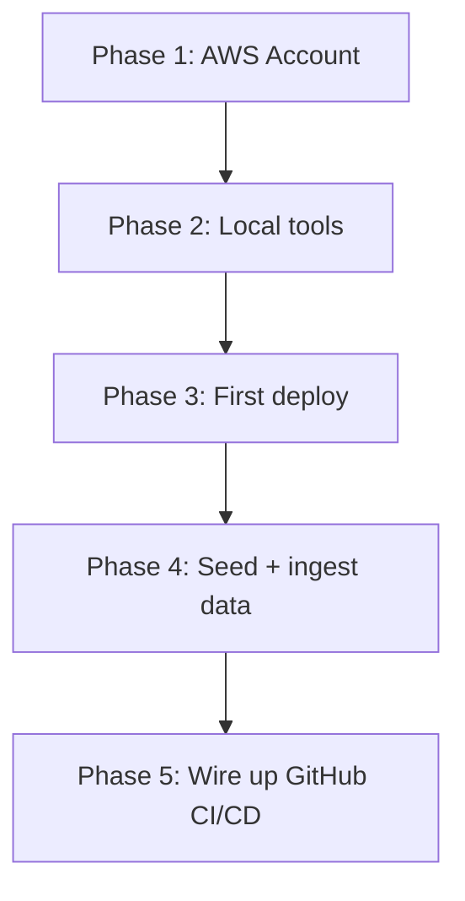
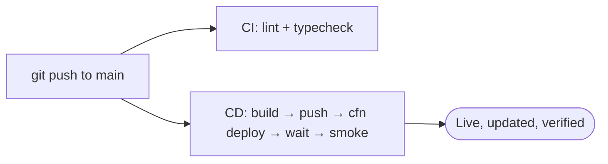

### Phase 1 — Create & secure the AWS account

1. Sign up at **aws.amazon.com** → create a root account (needs email + credit card).
2. **Do not use root for daily work.** In the IAM console, create an admin IAM user (e.g. `Yash`) with the `AdministratorAccess` policy, and create an **access key** for it. *(Your account already has this — user `Yash`.)*
3. Enable MFA on root, then lock root away.

### Phase 2 — Set up your local machine

```bash
# Install tools (macOS)
brew install awscli docker jq
brew install --cask session-manager-plugin   # needed for ECS Exec seeding

# Configure your AWS credentials (this writes ~/.aws/credentials)
aws configure
#   AWS Access Key ID:     <from Phase 1>
#   AWS Secret Access Key: <from Phase 1>
#   Default region name:   us-east-1
#   Default output format: json

# Verify it works
aws sts get-caller-identity     # should print your account ID
```

You'll also need a running **Docker** (with buildx) and these third-party keys ready: **OpenAI**, **Tavily**, and an **Upstash Redis** REST URL + token.

> Apple Silicon note: Fargate is `linux/amd64`. The build scripts already use `docker buildx build --platform linux/amd64`, so you're covered.

### Phase 3 — First deploy

```bash
# 1. Build & push BOTH images to ECR (scripts auto-create the repos)
scripts/aws/01_ecr_build_push.sh        # app image
scripts/aws/14_ecr_build_push_ui.sh     # streamlit UI image

# 2. Provide secrets and deploy the whole stack
export OPENAI_API_KEY=sk-...
export TAVILY_API_KEY=...
export UPSTASH_REDIS_URL=https://...upstash.io
export UPSTASH_REDIS_TOKEN=...
export CREATE_GITHUB_OIDC_PROVIDER=true   # ONLY on the very first deploy in a fresh account
scripts/aws/11_cfn_deploy.sh
```

11_cfn_deploy.sh auto-discovers your default VPC + subnets, generates a random JWT secret and Postgres password, and creates **all ~40 resources** in one shot. It prints the stack outputs (including your public URL) at the end.

> ⚠️ The OIDC provider (`token.actions.githubusercontent.com`) can only exist **once per account**. Set `CREATE_GITHUB_OIDC_PROVIDER=true` the first time only; leave it `false` afterward (the default).

### Phase 4 — Seed the database and ingest documents

```bash
# Create DB tables + demo users inside the live container (via ECS Exec)
scripts/aws/08_bootstrap.sh

# Upload your corpus to S3, then run parallel ingestion into Qdrant
scripts/aws/15_upload_noisy_to_s3.sh
SIZE_MB=200 PARALLELISM=4 scripts/aws/16_run_s3_ingest.sh

# Confirm everything answers
scripts/aws/09_smoke.sh
```

### Phase 5 — Connect GitHub Actions (CI/CD)

1. Grab the deploy role ARN from the stack output:
  ```bash
    scripts/aws/13_cfn_outputs.sh    # find GitHubDeployRoleArn# = arn:aws:iam::367012942955:role/adv-rag-cfn-github-deployer
  ```
2. In your GitHub repo → **Settings → Secrets and variables → Actions**, add:
  ```
    AWS_DEPLOY_ROLE_ARN = arn:aws:iam::<account>:role/adv-rag-cfn-github-deployer
  ```
3. Make sure the `GitHubRepo` parameter in the template matches your actual repo (`owner/repo`), and the branch you push from is in the OIDC trust's `StringLike` `sub` list (adv-rag.yml:746). Currently it trusts `main` and `deployment/aws-cloudformation-fargate`.

### Phase 6 — From now on, deploys are automatic




Every push to `main` or the deployment branch rebuilds both images, pushes them tagged with the commit SHA, updates the CloudFormation stack to the new image, waits for ECS stability, and smoke-tests `/health`. For a manual deploy from your laptop, `scripts/aws/deploy.sh` does the same four steps.

**Rollback** is just redeploying a known-good SHA:

```bash
APP_IMAGE=<account>.dkr.ecr.us-east-1.amazonaws.com/adv-rag/app:<good-sha> \
  scripts/aws/12_cfn_update_image.sh
```

---

## Summary mental model

- **One template** (adv-rag.yml) defines everything → CloudFormation builds it.
- **Three Fargate services**: `app` (FastAPI + Postgres sidecar), `ui` (Streamlit), `qdrant` (vector DB). One ALB fronts them with path routing.
- **State lives on EFS + S3 + Secrets Manager**, never inside the disposable containers.
- **Ingestion** is a separate, parallelizable batch task that reads S3 → embeds → writes Qdrant.
- **CI/CD** uses GitHub OIDC (no stored keys) to build images and push stack updates on every commit.

